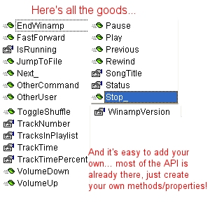



## WinampAPI Wrapper Class

### Description

This is the API wrapper class for Winamp v2 used by BlueAmp hotkey controller @ iawix.com. Check it out at - http://www.iawix.com/blueamp - Anyways, this class is the class to end all Winamp api classes. It rocks. See for yourself!
 
### More Info
 

             |
---                |---
**Submitted On**   |2003-01-07 19:20:30
**By**             |[iawix](https://github.com/Planet-Source-Code/PSCIndex/blob/master/ByAuthor/iawix.md)
**Level**          |Intermediate
**User Rating**    |5.0 (35 globes from 7 users)
**Compatibility**  |VB 4\.0 \(32\-bit\), VB 5\.0, VB 6\.0, VB Script, ASP \(Active Server Pages\) 
**Category**       |[Sound/MP3](https://github.com/Planet-Source-Code/PSCIndex/blob/master/ByCategory/sound-mp3__1-45.md)
**World**          |[Visual Basic](https://github.com/Planet-Source-Code/PSCIndex/blob/master/ByWorld/visual-basic.md)
**Archive File**   |[WinampAPI\_152565172003\.zip](https://github.com/Planet-Source-Code/iawix-winampapi-wrapper-class__1-42260/archive/master.zip)

